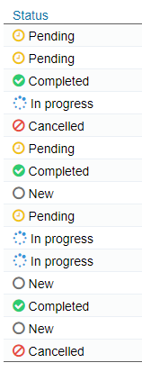

## Browse Screen: Add Icons in front of text

The function addStatusIconsFA() can be used to add icons in front of a text in a Browse column using [font awesome icons]( https://fontawesome.com/v4.7.0/icons/).


<p align="left">
  
</p>


☛ Add this JavaScript to your form's _Custom Code_ field:
 ❓ [How to add Custom Code](/common/form_add_custom_code_javascript.gif)
 
```javascript
function addStatusIconsFA(col, statusArr) {
	
	$("[data-nu-column='"+col+"']").each(function(index) {  
			
		var status  = $(this).html();			

		var index = statusArr.findIndex(x => x.status === status);
		var _class = statusArr[index].class;
		var color = statusArr[index].color;
		
	    $(this).prepend('<i class="'+ _class +'" aria-hidden="true" style="font-size:medium;color:'+color+';"></i>&nbsp;');

	})
}
```

#### ✪ Example 

Add a status icon in the first column when the Browse Screen is loaded.

☛ Change the status descriptions, icons, colors in statusArr if necessary.

```javascript

var statusArr = [
	{status:"Pending",class:"fa fa-clock-o",color:"#f1c40f"},             // orange
	{status:"Completed",class:"fa fa-check-circle",color:"#2ecc71"},      // green
	{status:"Cancelled",class:"fa fa-ban",color:"#e74c3c"},               // red	
	{status:"New",class:"fa fa-circle-o",color:"#707070"},                // grey
	{status:"In progress",class:"fa fa-spinner",color:"#3498db"}          // blue
]

if (nuFormType() == 'browse') {
    addStatusIconsFA(0, statusArr); // 0 = 1st column
}
```


### Using your own images instead of font awesome icons

☛ Create a new folder _/ressources_ in the root directory of nuBuilder and place your image files there.

☛ Add this JavaScript code to your form's _Custom Code_ field.


```javascript
function addStatusIcons(col) {
	$("[data-nu-column='"+col+"']").each(function(index) {  
			
		var status  = $(this).html();	
		var icon = 'ressources/' + status.replace(' ','_').toLowerCase() + '.png';
		
		var x = '' + '&nbsp;&nbsp;' + status;
		$(this).html(x);

	})
}

if (nuFormType() == 'browse') {
   addStatusIcons(0);
}

```
