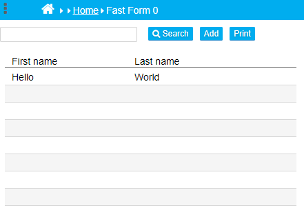

## Browse Screen: Prevent the columns from becoming too wide

By default, nuBuilder stretches browse columns to fill the document width. 
Too wide columns will be harder for the eye to follow and to read.

<p align="left">
  
</p>


To disable column stretching, the nuStopBrowserResize() function has to be added to a form's Custom Code > Javascript, 
for each Browse Screen you want to disable the auto resizing.

Result: The columns are more compacted:

<p align="left">
  
</p>


If you want to disable the column auto resizing globally (and also for all other nuBuilder Browse Screens),

☛  add this JavaScript in the Header (❓ [Home ► Setup](/common/setup_header.gif)). Click Save and log in again.

  
```javascript
// Fix: Do not stretch columns to full width
function nuResizeBrowseColumnsFix() {
    if (nuDocumentID == parent.nuDocumentID) {
		// do nothing
    } else {
        // call original message   
        _nuResizeBrowseColumns();
    }
}

var _nuResizeBrowseColumns = nuResizeBrowseColumns; 
var nuResizeBrowseColumns = function() {
	nuResizeBrowseColumnsFix();
}
 ```

