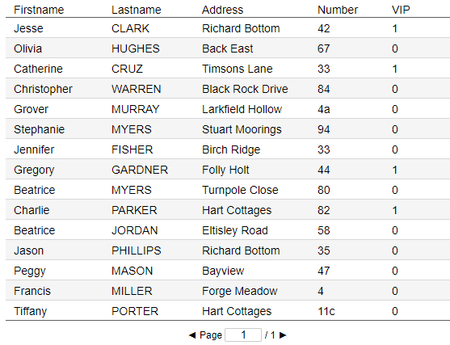

## Make Boolean Fields Show Check Marks

### nuBuilder's default

Boolean values are shown as 1 (true) and 0 (false)

<p align="left">
  
</p>

### Custom style

Make boolean fields show check marks or blanks based on their value.

<p align="left">
  
</p>


☛  Modify the Display field of your Boolean field:

<p align="left">
  
</p>


```
REPLACE(REPLACE(cus_active,1,'✔'),0,'')
```

