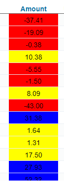

## Browse Screen: Conditionally format data

In this article, I’m going to show how to make important data in your Browse Screen stand out using "conditional formatting".
It is one of the best ways to draw attention to particular cell entries by automatically making those cells display differently from the cells around those exceptions.

In this example, we are going to change the (background) color of a Browse cell based on certain criteria, or conditions.

Below is an image showing the result of applying this code to a Browse Screen.

<p align="left">
  
</p>


### Example 1: 

This code will make the negative numbers show up in red in column 3 and 4, while everything else remains the same.


☛Add this JavaScript Code to your form’s Custom Code field. 

❓ [How to add Custom Code](/codelib/common/form_add_custom_code_javascript.gif)


```javascript
function browseNegativeNumbersRed() {
	$('[data-nu-column="2"],[data-nu-column="3"]').each(function(index) {	   
	   if (Number($(this).html()) < 0) {
		$(this).css("color", 'red');
	   }
	});
}

if (nuFormType() == 'browse') {
	browseNegativeNumbersRed()
}
```

### Example 2: 

In the example below, we will set conditional formatting in column 3 so that a cell's background color

- turns red if it contains a value smaller than 0.
- turns blue if it contains a value greater than equal to 20.
- turns yellow in all other cases.


```javascript

function browseConditionalFormatting() {
	$('[data-nu-column="2"]').each(function(index) {
	   var v = $(this).html();
	   var color = Number(v) < 0 ? 'red' : Number(v) > 20 ? 'blue': 'yellow';
	   $(this).css("background-color", color);
	});
}

if (nuFormType() == 'browse') {
  browseConditionalFormatting();
}
```
