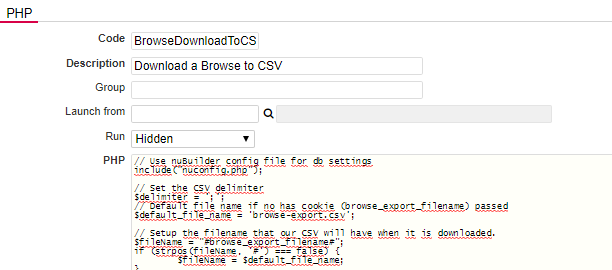

### Adding a "Download to CSV" button in a Browse Screen

1. Create a [Procedure](https://wiki.nubuilder.net/nubuilderforte/index.php/Procedures): Tab Builders -> Procedure -> Add

2. Code: BrowseDownloadToCSV

3. Give it a description. (E.g. Downloads data in a Browse Screen as a csv)

4. Paste the PHP code from the file [BrowseDownloadToCSV.php](BrowseDownloadToCSV.php) to the PHP field.

<p align="left">
  
</p>

5. Save

6. Add this JavaScript Code to your form’s *Custom Code* field:

❓ [How to add Custom Code](/codelib/common/form_add_custom_code_javascript.gif)

```
function base64encode(str) {
	let encode = encodeURIComponent(str).replace(/%([a-f0-9]{2})/gi, (m, $1) => String.fromCharCode(parseInt($1, 16)))
	return btoa(encode)
}

function browseDownloadToCSV() {
	nuSetProperty('browse_sql', base64encode(JSON.stringify(nuCurrentProperties().browse_sql)));
	nuRunPHP('BrowseDownloadToCSV');
}


if(nuFormType() == 'browse'){
    nuAddActionButton('browseDownloadToCSV', 'Download to CSV', 'browseDownloadToCSV();');
}
```

7. Save

Now you see a new button "Download to CSV" in your Browse Screen!
