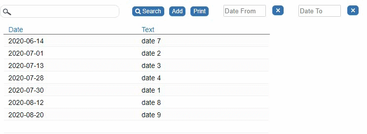

## Browse Screen: Filter Records by a Date Range


This snippet will show you how to add two Inputs of Type Date to filter the records by a date range.

<p align="left">
  
</p>

### 1. Add JavaScript Code

☛ Add this JavaScript Code to your form’s Custom Code field. 

<details>
  <summary>Click to view the code!</summary>
  
```javascript
function addDateFilterInput(id, placeholder) {
	
	// Date Inputs
	var inputStyle = 'style="margin-left: 30px; width: 80px; height: 22px; text-align: left"';
	var inputHtml = '<input id="' + id + '" type="nuDate" class="input_nuDate nuDate" data-nu-format="D|yyyy-mm-dd"  onclick="nuPopupCalendar(this);" placeholder="' + placeholder + '" autocomplete="off" ' + inputStyle + ' >';

	// Clear Buttons
	var btnStyle = 'style="font-size: 18px;"';
	var btnHtml = '<button class="nuActionButton" ' + btnStyle + ' id="btn_clear_' + id + '" >×</button>';

	$('#nuActionHolder').append(inputHtml + "&nbsp;" + btnHtml);

	var inputId = $("#" + id);
	inputId.on("blur", function() {
		nuSetProperty(id, this.value);
	});

	$('#btn_clear_' + id).click(function() {
		inputId.val('');
		nuSetProperty(id, '');
	});

	inputId.val(nuGetProperty(id) === undefined ? '' : nuGetProperty(id));

}


if (nuFormType() == 'browse') {
	addDateFilterInput('date_from', 'Date From');
	addDateFilterInput('date_to', 'Date To');
}
```
</details>

### 2. Modify Browse SQL

☛ Add a Where Clause in the Browse SQL:

☛ Replace *abc_date* with your date column.

```sql
WHERE (
    IF('#date_from#' <> '' AND '#date_from#' not like '#%', abc_date >= '#date_from#', 1)
    AND
    IF('#date_to#' <> '' AND '#date_to#' not like '#%', abc_date <= '#date_to#', 1)
)
ORDER BY abc_date

```

