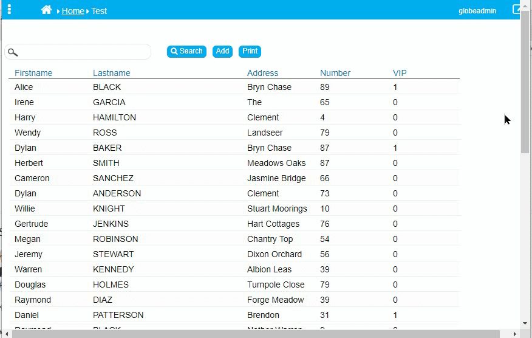

## Browse Screen: Sticky Headers

This code is useful if your Browse Screen shows more than 25 "Rows Per Page" or the screen resolution is smaller.
The following code will show the headers of a Browse table remain fixed at the top of the screen while you scroll down through the table. 
They are used to help the viewers to know the purpose of data in the columns when the original headers are lost from the view. 
It eliminates the inconvenience of scrolling up and down the table to get the reference of the data being read.

<p align="left">
  
</p>


☛ Add this JavaScript Code to your form’s Custom Code field. 
❓ [How to add Custom Code](/codelib/common/form_add_custom_code_javascript.gif)
  
```javascript
if (nuFormType() == 'browse') {

    $(window).scroll(function(e) {

        var scrollTop = $(window).scrollTop();

        $('.nuBrowseTitle').each(function() {
            if (scrollTop > 0) {
                $(this).css({ 'top': scrollTop, 'z-index': '100', 'position': 'fixed' });
            } else {
                $(this).css({ 'top': 3, 'z-index': '0', 'position': 'absolute' });
            }
        });
    });

}

```

