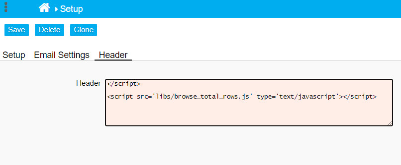

## addBrowseColumnTotal()

The function [addBrowseColumnTotal()](browse_total_rows.js) can be added to a form's Custom Code to add a total row (or multiple total rows) at the bottom of a Browse Table.

```javascript
addBrowseColumnTotal(columns, op, number, title); 
```

The function takes the following arguments:

- **columns**: Columns for which a total will be displayed. array of columns. E.g. ['1','2']
- **op** (operation): *Sum*: totalOperations.SUM, *Average*: totalOperations.AVG, *Weighted Average*: totalOperations.AVG_W
- (total row) **number**: Number of the total row. There can be more than one total row. 
- (total row) **title**: Title of the total row

### Example 1:  Add a total row (sum)

```javascript
  addBrowseColumnTotal(['1','2','3','4'], totalOperations.SUM, 1, 'Total');  
```

<p align="left">
  
</p>

### Example 2: Adding multiple total rows

```javascript
  addBrowseColumnTotal(['1','2','3','4'], totalOperations.SUM, 1, 'Sum');
  addBrowseColumnTotal(['1','2','3','4'], totalOperations.AVG, 2, 'Average');
```

<p align="left">
  
</p>


### Using the function in several Browse Screens.

If you want to use the addBrowseColumnTotal() function in several Browse Screens, you should create an external JavaScript file, instead of including the same script in every form (redundancy). Place the browse_total_rows.js in a subfolder of nuBuilder root directory (e.g. /libs), and then refer to it by adding this JavaScript to (Setup ->) Header:

```javascript
</script>
<script src='libs/browse_total_rows.js' type='text/javascript'></script>
```

<p align="left">
  
</p>
