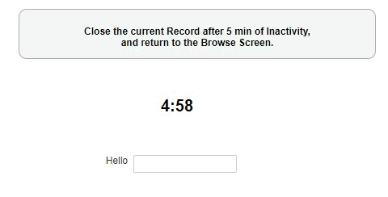

## Edit Screen: Return to the Browse Screen after an inactivity timeout period

This snippet will (forcefully) redirect the user back to the Browse Screen after an inactivity timeout period. A countdown timer will show the time left.
When the mouse is moved, the timer is reset.

<p align="left">
  
</p>


If you just want to try the sample, go ahead and import [countdownBE.sql.gzip](/codelib/db_dump_countdownBE.sql.gzip) into your existing nuBuilder Database (using phpMyAdmin).
The dump contains a form, objects and a table. It will not overwrite/modify/delete any other data.


☛ This script expects a "Word" Object with an ID "counter" on your form.
☛ You can change that to what ever you want. (Also rename the variable *counter_id* in the code.)
☛ Change the timeout period (*countdown_time* variable)

☛ Add this JavaScript to your form's *Custom Code* field:

 ❓ [How to add Custom Code](/codelib/common/form_add_custom_code_javascript.gif)
 
```javascript
var counter_id = "counter";
var countdown_time = 5; // number of minutes
var trackSelector = 'input, textarea, select, button, a, #nuhtml';

var form_id;
var timer;

function countdown(minutes) {

	var sec = 60;
	var mins = minutes;

	function tick() {

		checkStopTimer();

		var counter = $('#' + counter_id);
		var min = mins - 1;
		sec--;
		counter.html(min.toString() + ":" + nuPad2(sec));

		checkTimeOutEnd(sec, mins);

		if (sec > 0) {
			if (timer == 0) {
				return;
			}
			timer = setTimeout(tick, 1000);
		} else {
			if (mins > 1) {
				countdown(mins - 1);
			}
		}

	}
	tick();
}

if (nuFormType() == 'edit') {
	form_id = nuCurrentProperties().form_id;
	$('#' + counter_id).css('font-size', '20px');

	startActivityTracker();
	startTimer();
}

function mousemove() {
	stopTimer();
	startTimer();
};

function startActivityTracker() {
	$(document).ready(function() {
		$(trackSelector).mousemove(mousemove);
	});
}

function stopActivityTracker() {
	$(trackSelector).off('mousemove', mousemove);
}

function startTimer() {
	timer = -1;
	countdown(countdown_time);
}

function stopTimer() {
	clearTimeout(timer);
	timer = 0;
}

function gotoPrevBreadcrumb() {
	if (parent.$('#nuModal').length > 0) {
		nuClosePopup();
		return;
	}

	var l = window.nuFORM.breadcrumbs.length;
	if (l > 1) {
		nuGetBreadcrumb(l - 2);
	}
}

function checkTimeOutEnd(sec, min) {
	if (sec == 0 && min == 1) {
		stopTimer();
		stopActivityTracker();
		nuHasNotBeenEdited();
		gotoPrevBreadcrumb();
	}
}

function checkStopTimer() {
	if (nuCurrentProperties().form_id != form_id || nuFormType() != 'edit') {
		stopTimer();
		stopActivityTracker();
	}
}
```

