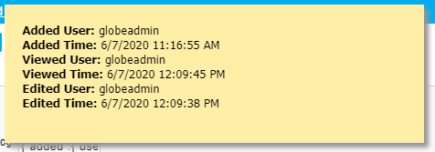

### Edit Screen: Show Logging Activity

As explained in this [Wiki article](https://wiki.nubuilder.net/nubuilderforte/index.php/Logging_Activity), 
nuBuilder Forte can track when records are Added, Accessed, Edited. 

But how do we retrieve this information and display it in an Edit Screen? 


<p align="left">
  
</p>


Add a new Object (Type Text) to your from with the Object ID of your nulog Field. (e.g. mytable_nulog).
Set its access to *Hidden*.

☛Add this JavaScript Code to your form’s Custom Code field.
(Or in Setup -> Header, if you are planning to use the function in several forms)

❓ [How to add Custom Code](/codelib/common/form_add_custom_code_javascript.gif)


```javascript
function formatUnixDateTime(t, locales, dOptions, tOptions) {

    if (typeof dOptions === 'undefined') {
        var dOptions = {};
    }
    if (typeof tOptions === 'undefined') {
        var tOptions = {};
    }
    var d = new Date(t * 1000);
    return d.toLocaleDateString(locales, dOptions) + ' ' + d.toLocaleTimeString(locales, tOptions);
}

function getNuLogData(obj, type, what) {

    var undef = (typeof obj === 'undefined');
    var info = '<b>' + nuTranslate(type + ' ' + what) + ':</b> ';

    if (what == 'User') {
        return undef ? '' : info + obj.user + "<br>";
    } else
    if (what == 'Time') {
        return undef ? '' : info + formatUnixDateTime(obj.time, "en-US") + "<br>";
    }
}
```

#### ✪ Example

Add a Button Object to your form with the Label **?** and an onclick handler. 
JavaScript: showNuLogInfo('example_nulog');

When the button is clicked, the logging activity is displayed in a message box.

```javascript
function showNuLogInfo(id) {

    var nuLog = $('#' + id).val();
    var obj = JSON.parse(nuLog);

    var msg = getNuLogData(obj.added, 'Added', 'User') + getNuLogData(obj.added, 'Added', 'Time');
    msg += getNuLogData(obj.viewed, 'Viewed', 'User') + getNuLogData(obj.viewed, 'Viewed', 'Time');
    msg += getNuLogData(obj.edited, 'Edited', 'User') + getNuLogData(obj.edited, 'Edited', 'Time');

    nuMessage([msg]);
    $('#nuMessageDiv').css('text-align', 'left');
}
```

#### Useful links:    

Language locales list:
https://www.w3schools.com/jsref/jsref_tolocalestring.asp
