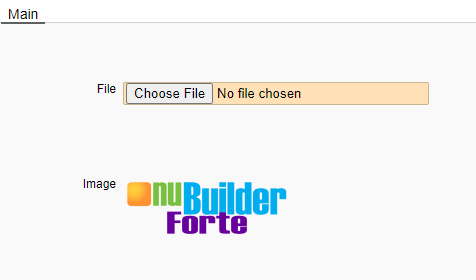
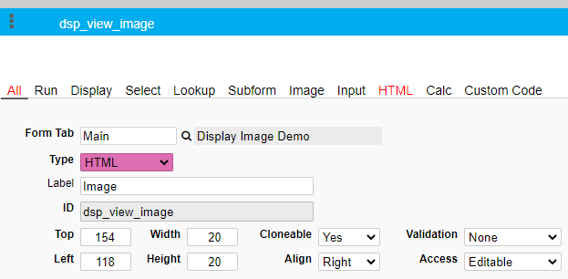
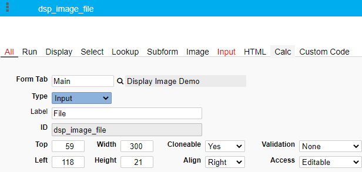
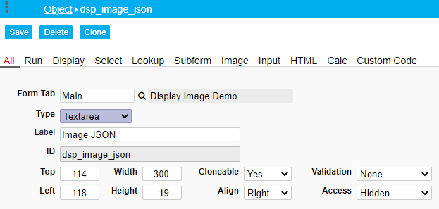
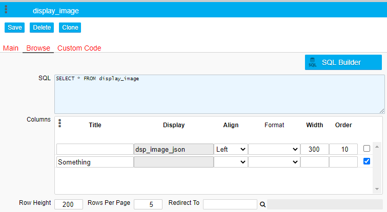

## Edit Screen: Upload an Image and Display it

This snippet is going to show how to upload an image to the database and display it on the Browse and Edit Screen. The image is shown in its original size (Only in the Edit screen)

<p align="left">
  
</p>

If you want to see it in action right away, import the [sample](/sample/2020-08-13_004115_display_image.zip) into your existing nuBuilder database. 

❓ [Instructions to import the sample](/codelib/common/import_sample_sql_file.md) 

Otherwise, follow the steps below.

<b>1.</b> Create a new Object of type HTML. 

* Object ID: *dsp_view_image* 
* Its width and height can be set to a small value, e.g. 20.
* In the HTML field (HTML tab), enter a Space.

<p align="left">
  
</p>


This is where the image is displayed after saving the form.

<b>2.</b> Create a new File Object: 

* Object ID: *dsp_image_file* 
* Type: Input
* Label: File
* Width: 300
* Height: 21
* Input Tab: File

<p align="left">
  
</p>

 This allows the user to pick a file from the local drive to upload.
 
<b>3.</b> Create a Textarea Object: 

* Object ID: *dsp_image_json* 
* Access: Hidden

<p align="left">
  
</p>

The image JSON is stored in this invisible field.

☛  Also create this column in your database table using e.g. phpMyAdmin. Type: longtext

<b>4.</b> Custom Code

☛  In your form’s *Custom Code* field, add the following JavaScript code:

❓ [How to add Custom Code](/codelib/common/form_add_custom_code_javascript.gif)

<details>
  <summary>Click to view the code!</summary>
  
```javascript

// Get the image dimensions
function getImageMeta(url, callback) {
    var img = new Image();
    img.src = url;
    img.onload = function () {
        callback(this.width, this.height);
    }
}

// Converts a JSON string to an embedded HTML Object to display an image
function embedImage(json, d, w , h) {

    if (json === '') {
        return;
    }

    var ob = JSON.parse(json);
    var ty = ob.type;
    var ur = atob(ob.file);

    getImageMeta(ur, function (width, height) {
        var x = document.createElement("EMBED");

        x.setAttribute("type", ty);
        x.setAttribute("src", ur);
     
        if(w !== undefined){ width = w; }
	    if(h !== undefined){ height = h; }
	
        x.setAttribute("width", width);
        x.setAttribute("height", height);

        $('#' + d).html('');
        document.getElementById(d).appendChild(x);

    });

}

// Display the image in the Edit and Browse Screen
if (nuFormType() == 'edit') {
    $('#dsp_image_file_file').attr('accept','.gif,.jpg,.jpeg,.png');
    showEditImage();
} else {
    showBrowseImages();
}


function nuBeforeSave() {

    var f = $('#dsp_image_file').val();

    if (f !== '') {
        $('#dsp_image_json')
            .val(f)
            .change();
    }
    return true;

}


function showEditImage() {
    var json = $('#dsp_image_json').val();
    embedImage(json, 'dsp_view_image');
}


function showBrowseImages() {

    $('[data-nu-column="0"]').each(function (index) {
        var h = $(this).html();
        if (h !== '' && h !== undefined) {
            nuEmbedObject(h, $(this).attr('id'), 140, 140);
        }
    });

}
```
</details>

<b>5.</b> 
Open *Form Properties* (CTRL+SHIFT+F) and set the *Row Height* of the Browse Screen to 200 and *Rows Per Page* to 5.

<p align="left">
  
</p>


