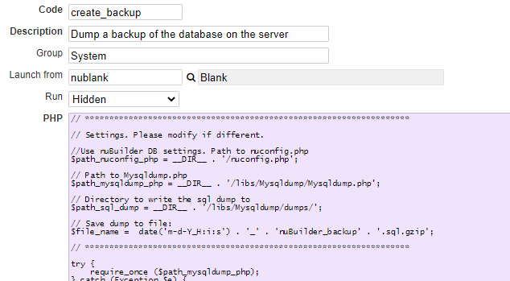

### Globeadmin: Create a Backup of your nuBuilder Database

It is important to create and keep backups of your nuBuilder database to ensure you are able to restore them in the event of data loss. 
Downloading copies in the form of .sql files, can save you unnecessary stress and prevent future headaches. 

You can accomplish this using the [mysqldump](https://dev.mysql.com/doc/refman/8.0/en/mysqldump.html) command-line function or phpMyAdmin by exporting your database to an sql file.
However mysqldump is not always available, for example in a production server environment or on a shared hosting where shell access is denied.

This snippet is going to show a third possibility that uses the open source library [Mysqldump.php](https://github.com/ifsnop/mysqldump-php).
This is a php version of mysqldump cli that comes with MySQL, without dependencies, output compression and much more.

#### Download Mysqldump.php

Download [Mysqldump.php](https://github.com/ifsnop/mysqldump-php/blob/master/src/Ifsnop/Mysqldump/Mysqldump.php) and place it in a folder */libs/upload/Mysqldump* of your nuBuilder root directory.

#### Create a Procedure

Create a [Procedure](https://wiki.nubuilder.net/nubuilderforte/index.php/Procedures): *Tab Builders -> Procedure -> Add.

☛ Enter a Code: e.g. *create_backup*

☛ Fill in the other fields:

<p align="left">
  
</p>

☛ Paste the PHP code from the file [procedure_create_backup.php](procedure_create_backup.php) to the PHP field.

☛ Click *Save*.

#### Run the Procedure

Now you can create ad-hoc backups of your data at any time you need.
To do so, open the Setup Tab in nuBuilder, click on the button "Run Procedure", choose the Procedure *create_backup* and run it.

#### Automate the Export Process

Moreover, you can also create scheduled backups to automate the export process (e.g. create a nightly backup). To do so,  you can use the procedure from this snippet:
[Automation: How to run a PHP procedure from outside nuBuilder?](https://github.com/smalos/nuBuilder4-Code-Library/tree/master/codelib/automation_call_procedure_externally)

Please note that the paths must be changed when the script is called from the cron job:

```php
//Use nuBuilder DB settings. Path to nuconfig.php
$path_nuconfig_php = __DIR__ . '/../nuconfig.php';

// Path to Mysqldump.php
$path_mysqldump_php = __DIR__ . '/Mysqldump/Mysqldump.php';

// Directory to write the sql dump to
$path_sql_dump = __DIR__ . '/Mysqldump/dumps/';
```

## Related Articles

[Restore a Database using PHPMyAdmin](https://github.com/smalos/nuBuilder4-Code-Library/wiki/Restore-a-Database-using-PHPMyAdmin)
