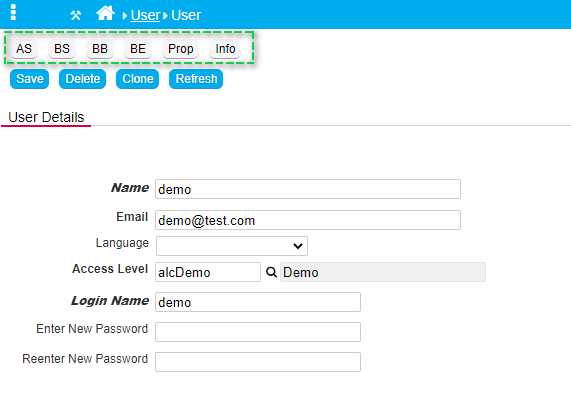
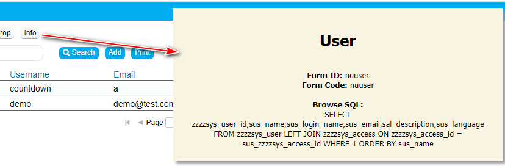

## Globeadmin: Add additional Developer Action Buttons

The function addDevButtons() adds additional buttons for the globeadmin for quick access to the Form Properties, PHP Events. 

<p align="left">
  
</p>


View the Form Description, Form ID, Form Code and Record ID, Browse SQL (Browse Forms)  on a button click:

<p align="left">
  
</p>


☛  Add this JavaScript and CSS code in the Header (❓ [Home ► Setup](/common/setup_header.gif)). Click Save and log in again.

```javascript
function editPHP(type) {
    nuForm('nuphp', nuCurrentProperties().form_id + '_' + type, 'justphp', '', 2);
}

function openCurrentProperties() {
    nuForm('nuform', window.nuFORM.getCurrent().form_id, '', '', 2);
}

function addDevButton(i, v, f) {
    var button = "<input id='nu" + i + "Button' type='button' class='nuActionButton' value='" + nuTranslate(v) + "' onclick='" + f + "'>";
    $('#nuActionHolder').prepend(button);
}

jQuery.fn.cssNumber = function(prop) {
    var v = parseInt(this.css(prop), 10);
    return isNaN(v) ? 0 : v;
};

function showFormInfo() {
    var cp = nuCurrentProperties();
    var record_id = nuFormType() == 'edit' && cp.form_type !== 'launch' ? "<b>Record ID:</b> " + cp.record_id : '';
    var browse_sql = nuFormType() == 'browse' ? "<b>Browse SQL:</b></br> " + cp.browse_sql : '';

    nuMessage(["<h1>" + cp.form_description + "</h1>", "<b>Form ID:</b> " + cp.form_id, "<b>Form Code:</b> " + cp.form_code, record_id, browse_sql]);
}
function addDevButtons() {

    if (global_access) {
        var ft = nuCurrentProperties().form_type;
        var b = ft.indexOf("browse") >= 0;
        var e = ft.indexOf("edit") >= 0;
        var l = ft.indexOf("launch") >= 0;

        $('#nuActionHolder').css('height', '50px');
        
        addDevButton("DevBtnFormInfo", "Info", 'showFormInfo();');
        addDevButton("DevBtnProperties", "Prop", 'openCurrentProperties();');
               
        if (b || l) { addDevButton("DevBtnBE", "BE", 'editPHP("BE");'); }
        if (e) { addDevButton("DevBtnBB", "BB", 'editPHP("BB");'); }
        if (e) { addDevButton("DevBtnBS", "BS", 'editPHP("BS");'); }
        if (e) { addDevButton("DevBtnAS", "AS", 'editPHP("AS");'); }

        var frame = parent.$('#nuDragDialog iframe')
        frame.css('height', frame.cssNumber("height") + 50);

        var dragDialog = parent.$('#nuDragDialog')
        dragDialog.css('height', dragDialog.cssNumber("height") + 50);

        $("input[type='button'][id^='nuDevBtn']").css({ 'margin-bottom': '10px', 'background-color': '#f6f6f6', 'background-image': 'none', 'color': 'black', 'border-color': '#9fa5a9', 'text-shadow': 'none' });
        $("<br>").insertAfter($("#nuDevBtnFormInfoButton"));
    }

}

function nuOnLoad() {
    addDevButtons();
}
```

