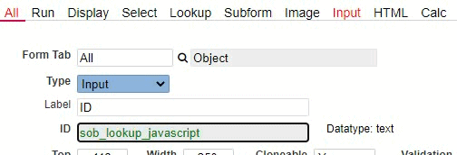

## Globeadmin Helper: Display the Data Type of a Database Column next to the Object ID.

This helper will indicate if the corresponding database column exists for an Object ID and also displays the data type of the column.
In this way you can instantly verify if a data type is correct (or if it makes sense) and if the field exists in the database without having to open phpMyAdmin every time.

<p align="left">
  
</p>


☛  Add this JavaScript code in the Header (❓ [Home ► Setup](codelib/common/setup_header.gif)). 

☛  Then click *Save*, and log in again for the changes to take effect


<details>
 <summary>Click to view the code!</summary>
  
```javascript
function columnDataType(table, id) {
    var s = nuFORM.tableSchema[table];
    var n = s.names;
    var i = n.indexOf(id.val());
    return i > -1 ? s.types[i] : '';
}

jQuery.fn.cssNumber = function (prop) {
    var v = parseInt(this.css(prop), 10);
    return isNaN(v) ? 0 : v;
};

function showDataType(id) {
    var table = $("#sob_all_table").val();
    var dataType = columnDataType(table, id);

    if ($('#nuDataType').length == 0) {
        var s = $('<span id="nuDataType"></span>');
        $('#nuRECORD').append(s);
        s.css({
            "top": id.cssNumber("top"),
            "left": id.cssNumber("left") + id.cssNumber("width") + 25,
            "position": "absolute",
        });
    }

    $('#nuDataType').html(dataType == '' ? '' : 'Datatype: ' + dataType);
    dataType !== '' ? id.css('color', 'green') : id.css('color', 'black');    
}

function initShowDataType() {
    if (nuCurrentProperties().form_id == 'nuobject' && nuFormType() == 'edit') {
        var table = $("#sob_all_table").val();        
        if (table !== '') {
            var id = $('#sob_all_id');
            showDataType(id);
            id.on('input change', function () {
                console.log('changed');
                showDataType(id);
            });
        }
    }
}

// Call initShowDataType() in nuOnLoad()
function nuOnLoad() {
    initShowDataType();
}```

```
</details>
