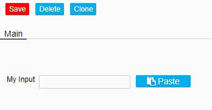
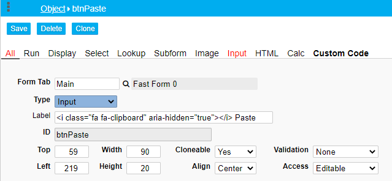
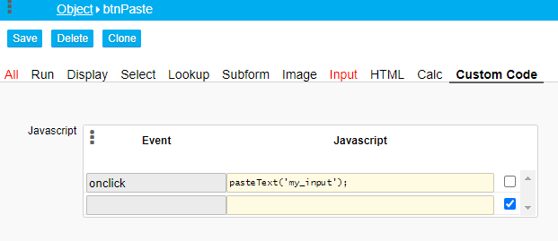

### Input: Use a Button to Paste text from the Clipboard

This snippet fetches the text from the clipboard and pastes it into an input field with the Object ID “my_input”.

<p align="left">
  
</p>


☛  Add this code to your form’s custom code field.

❓ [How to add Custom Code](/codelib/common/form_add_custom_code_javascript.gif)

```javascript
function pasteText(t) {

    navigator.clipboard.readText()
        .then(text => {
            $('#' + t).val(text);
        });
}
```

To try out the following example, add a Button Object to your form:

<p align="left">
  
</p>

In the *Custom Code* tab, add an onclick event:

☛  Replace *my_input* with your Object ID.

<p align="left">
  
</p>


#### Note 

You must give the webpage permission to access the clipboard for security reasons, 
so the first time you click on the input on that page it will popup asking your permission 
to access the clipboard. 
Once you give it access any clicks into the input will paste whatever is on your clipboard.


#### Useful link  

https://developer.mozilla.org/en-US/docs/Web/API/Clipboard_API
