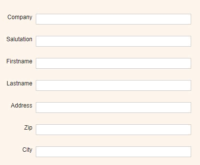

### Positioning labels above objects

This is especially useful when the caption is a little longer and it would take up too much space horizontally.

<p align="left">
  
</p>

☛</strong>  Add this JavaScript to your form’s Custom Code field</p>

❓ [How to add Custom Code](/codelib/common/form_add_custom_code_javascript.gif)

```javascript
/**
 * Position a label at the top of its object
 *
 * @param  {array}   f     - Array of object IDs to include
 * @param  {array}   e     - Array of object IDs to exclude
 */
function labelOnTop(f, e) {

    for (var i = 0; i < f.length; i++) {
        if (jQuery.inArray(f[i], e) == -1) {

            $('#' + 'label_' + f[i]).css({
                   'top': parseInt($('#'+f[i]).css("top")) - 18
                , 'left': parseInt($('#'+f[i]).css("left"))- 15
                , 'text-align': 'left'
            })
        }
    }
}

// Add a function called labelOnTop to $.fn and it will be available just like any other jQuery object method

/**
 *
 * @param   {int}   [offsetTop]     - Left offset to the object in pixels
 * @param   {int}   [offsetLeft]    - Left offset to the object in pixels
 */

jQuery.fn.labelOnTop = function (offsetTop = -18, offsetLeft = 0) {

    return this.each(function () {
        $('#' + 'label_' + this.id).css({
            'top': parseInt($(this).css("top")) + offsetTop
            , 'left': parseInt($(this).css("left")) + offsetLeft
            , 'text-align': 'left'
        })
    });

};

```

#### ✪ Example 1: 

Position all labels at the top of their objects:

```javascript
if (nuFormType() == 'edit') {
    var f = nuSubformObject("").fields;          // include all objects of your main form.
    labelOnTop(f, []);
}
```

#### ✪ Example 2</strong>: 
  
Position all labels above their objects, but exclude some:

```javascript
if (nuFormType() == 'edit') {
    var f = nuSubformObject("").fields;          // include all objects of your form
    var e = ["cus_firstname", "cus_lastname"];   // but exclude these two objects
    labelOnTop(f, e);
}
```

#### ✪ Example 3: 

Position the labels of some objects above their objects:

```javascript
if (nuFormType() == 'edit') {
    var f = ["cus_firstname", "cus_lastname"];   // include just these two objects
    labelOnTop(f, []);
}
```

#### ✪ Example 4: 

Position the labels of all objects at the top of their objects:

```javascript
if (nuFormType() == 'edit') {
    $('input').labelOnTop();
}
```

#### ✪ Example 5: 

Position all labels of the subform with ID subfromObjID at the top of their objects:
(Do not forget to do the positioning again when a new subform row is added. Use the afterinsertrow event of the subform.)


```javascript
if (nuFormType() == 'edit') {
    $('[id^=subfromObjID]).labelOnTop();
}
```

#### ✪ Example 6: 

Position the label of the Object with ID firstname in the subform with ID subfromObjID at the top of its object:

```javascript
if (nuFormType() == 'edit') {
	$('[id^=subfromObjID][id$=firstname]').labelOnTop();
}
```
