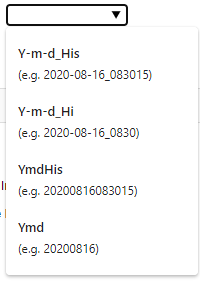

### Object: Use a HTML5 Datalist Element (Autocomplete Feature)

The HTML `<datalist>` tag is is used to provide an auto complete feature on form element. 
These suggested values will appear in the input control as a dropdown list and the available options will be filtered as the user enters data into the input control.
It also allows users to enter a custom value that is not in the list.

<p align="left">
  
</p>

The function addDatalist() will turn a nuBuilder Text Input Object into a datalist Element.

☛ Add this JavaScript Code to your form’s Custom Code field:

❓ [How to add Custom Code](/common/form_add_custom_code_javascript.gif)


```javascript
/**
 * Add a datalist to a Text Input Element
 *
 * @param  {string}  f     - Object ID of the Text Input
 * @param  {array}   a     - Array of strings or a 2D array (to show a value and text)
 */
function addDatalist(f, a) {
    var datalist = document.createElement('datalist');
    datalist.id = "datalist";
    document.body.appendChild(datalist);
    a.forEach(function (data) {
        var option = document.createElement('option');				
        option.value = $.isArray(data) ? data[0]: data;
        option.text =  $.isArray(data) ? data[1]: data;
        datalist.appendChild(option);
    });
    $('#' + f).attr('list', "datalist").attr('autocomplete', 'off');
}

```

#### ✪ Example 1

Add a datalist to the Text Input Object with ID *my_city*

```javascript
if (nuFormType() == 'edit') {
    var cities = ["Seattle", "Las Vegas", "New York", "Salt lake City"];
    addDatalist('my_city', cities);
}
```

#### ✪ Example 2

Add a datalist to the Text Input Object with ID *exp_prefix*

Pass a 2D array to display both a value and text.

```javascript
var prefixes = [
   ["Y-m-d_His","(e.g. 2020-08-16_083015)"],
   ["Y-m-d_Hi","(e.g. 2020-08-16_0830)"],
   ["YmdHis","(e.g. 20200816083015)"],
   ["Ymd","(e.g. 20200816)"]
];   

addDatalist('exp_prefix', ["Y-m-d_His", "YmdHis", "Ymd"]);
```

<p align="left">
  
</p>


#### ✪ Example 3 (Advanced)

Load the data from a database table.

☛ PHP Code to be added in the BE (Before Edit) PHP event:

```php
function getLanguageSQL() {
    $sql = "SELECT DISTINCT `trl_language` FROM `zzzzsys_translate` ORDER BY `trl_language`";
	return $sql;
}

function getLanguages() {

	$sql = getLanguageSQL();
	$result = nuRunQuery($sql);
	$a = array();
	while ($row = db_fetch_row($result)) {
	  $a[] = $row;
	}
	return base64_encode(json_encode( $a ));
	
}

$lang = getLanguages();


$js = "
	function getLanguages() {
		return atob('$lang');
	}
";

nuAddJavascript($js);
```

☛ JavaScript code to be added in the form's Custom Code.

```javascript
if (nuFormType() == 'edit') {
    var lang =  JSON.parse(getLanguages());
    addDatalist('my_languages', lang);
}
```


