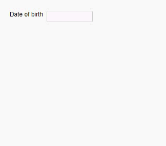

## Object:  Better user experience when entering a date of birth

When using a Date Object to enter a date of birth, it is inefficent and makes little sense to use the nuBuilder calender.
The year on date picker would have to be rolled back 10, 20, 50 or more years from today’s date. (~ 10, 20, 50+ clicks!)


<p align="left">
  
</p>


How to prevent the calendar from being displayed when the date field gets the focus?

Use the disableCalender() function and pass the object ID of your Date Object.

```javascript
function disableCalender(objId) {

    $('#'+objId).attr('onclick', null); 	
	
}
```
#### ✪ Example

☛ Add this JavaScript to your form's Custom Code field:
 ❓ [How to add Custom Code](/codelib/common/form_add_custom_code_javascript.gif)
   
```javascript
if (nuFormType() == 'edit') {
	disableCalender('my_date_field');
}	
```


The next problem is that the users do not see the format in which they are supposed to enter their birth date.
We will retrieve the date format from the data-nu-format attribute of the object and use this information by adding a placeholder to our date field.


```javascript
function setPlaceholder(objId, placeholder) {
    
    var f = $('#'+objId);    

    if (typeof placeholder === 'undefined') {	
		 placeholder = f.attr('data-nu-format').substring(2);
	}
       
     f.attr("placeholder", nuTranslate(placeholder));    
      
}
```

<p align="left">
  
</p>

#### ✪ Example

The final code is going to look like this:

```javascript
if (nuFormType() == 'edit') {
	disableCalender('my_date_field');
	setPlaceholder('my_date_field');
}	

```


