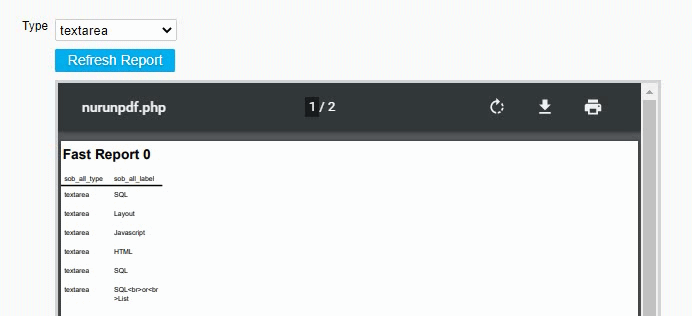

## Run Object: Refresh an iFrame

The function refreshiframe() will refresh a Run Object (iFrame). 

This is useful, for example, if a Hash Cookie is used in an SQL statement and, for example, a Report or Browse Screen has to be updated based on that filter.

<p align="left">
  
</p>


☛ Add this JavaScript to your form's *Custom Code* field:

 ❓ [How to add Custom Code](/codelib/common/form_add_custom_code_javascript.gif)

```javascript
function refreshiframe(id){

	var r = JSON.parse(JSON.stringify(nuSERVERRESPONSE));
	var o = -1;
	
	for(var i = 0 ; i < r.objects.length ; i++){
			if(r.objects[i].id == id){
				o = i;	
			}
	}

	if(o == -1){return;}
	nuRUN(r, o, '', '', r);

}
```

#### ✪ Example

Create a Button Object on your form and add an onclick Event under "Customer Code" with this JavaScript.

☛ Replace *run_object_id* with your Run Object ID.

```javascript
refreshiframe('run_object_id');
```

#### Related Functions

Use [nuFilterRun()](https://wiki.nubuilder.net/nubuilderforte/index.php/Javascript#nuFilterRun) to refresh an iFrame and set a filter at the same time.

