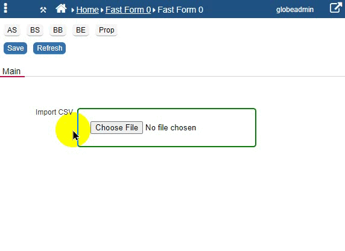
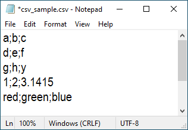
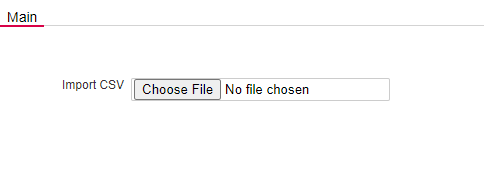

### PHP: How to import a CSV file into a database table

This snippet will show how to read the contents of a CSV file and insert that data into a database table. 

The final result is going to look like this:

<p align="left">
  
</p>

The following steps are carried out:

* Step 1: Select the CSV File to be imported
* Step 2: The First few rows of data will be previewed, verify everything is fine.
* Step 3: Once Ok with preview, hit the "Import Data" Button.
* Step 4: If the file was successfully imported, a message "CSV upload completed!" is displayed.

We will start by looking at the contents of the CSV file that we are importing. 

<p align="left">
  
</p>

The column headings are not included and each field is delimited by a semicolon <;>.
The database table that we will be importing into is defined with 3 columns (col1,col2,col3) to match the input file. The table is automatically created if it does not exist.


#### Create a Procedure

1. First, create a [Procedure](https://wiki.nubuilder.net/nubuilderforte/index.php/Procedures): *Tab Builders -> Procedure -> Add* 

2. Code: e.g. *csv_upload*

3. Description: Enter a description for the procedure. E.g. *Upload CSV to Table data_csv*

4. Pick "Hidden" from the select.

5. Paste this PHP code

```php

$table = "data_csv";
$separator = ";";
$txt = '#csv_content#';

$q = "
	CREATE TABLE IF NOT EXISTS $table (
		col1 VARCHAR(50),
		col2 VARCHAR(50),
		col3 VARCHAR(50)
	)
";

$t = nuRunQuery($q);
$firstDimension = explode("\n", $txt);

$result = [];
foreach ($firstDimension as $temp) {
    $result[] = explode($separator, $temp);
}

$lines = 0;
foreach ($result as $data) {
    if (isset($data[1])) {
        $lines++;
        $q = "
	   INSERT INTO $table (col1, col2, col3)
	   VALUES(?, ?, ?)
        ";
        $t = nuRunQuery($q, [$data[0], $data[1], $data[2]]);
    }
}

$js = "nuMessage(['<h1>CSV upload completed!<br>Number of lines uploaded: $lines<br>Data stored in the $table table.</h1>']);";
nuJavascriptCallback($js);

```

6. Save

#### Create a HTML object

7. In your form, create a new object of type HTML. Any object ID can be entered.
The HTML object holds code which creates a file upload object and processes the file upload.

   ☛  Add this code in the HTML field (HTML tab).

```javascript

<style>
input[type=file] {
  border: 2px solid green;
  border-radius: 5px;
  padding: 20px 20px;
}
</style>

<input type='file' id="csvupload" onChange="readSingleFile(this);"/>

<script>
	
	var content;

	function genHTMLTable(header, data) {


	    var table = "<table border='1' style='border-collapse: collapse;'><tbody><tr>";
	    for (var i = 0; i < header.length; i++) {
	        table = table + "<td><strong>" + header[i] + "</strong></td>";
	    }

	    table = table + '</tr><tr>';
	    for (l = 0; l < data.length; l++) {
	        v = data[l].split(';');
	        for (var i = 0; i < v.length; i++) {
	            table = table + "<td>" + v[i] + "</td>";
	        }

	        table = table + "</tr><tr>";
	    }

	    table = table + "</tr></tbody></table>";

	    return table;
	}


	function readSingleFile(e) {

	    var file = e.files[0];

	    if (!file) {
	        return;
	    }

	    var reader = new FileReader();
	    reader.onload = function (e) {
	        content = e.target.result;
	        $("#csvupload").val(null);


	        var firstLine = content.split("\n").slice(0, 5);

	        var preview = genHTMLTable(['col1', 'col2', 'col3'], firstLine);
	        var buttons = '<button id="uploadbutton" type="button" onclick="uploadFile();" class="nuActionButton">Import Data</button> <button onclick="$(\'#nuMessageDiv\').remove();" class="nuActionButton nuSaveButtonEdited">Cancel</button>';
	        nuMessage(['<h1>CSV Import Preview</h1><h3>(First 5 lines)</h2><center>' + preview + '</center><br><br>' + buttons]);

	    };
	    reader.readAsText(file);
	}

	function uploadFile() {
	    nuDisable('uploadbutton');
	    nuSetProperty('csv_content', content);
	    nuRunPHPHidden('csv_upload', 0);
	}
	

</script>


```

#### Test it!

Click "Choose File" and pick the csv_sample.csv.

<p align="left">
  
</p>


**Credits**: Janusz
