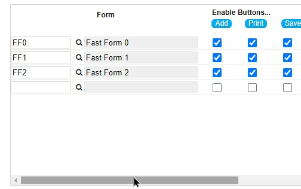

###  Subform: Freeze the first column upon scrolling horizontally

If your subfrom contains a lot of columns and becomes too wide to fit on the screen, you might want to freeze (the first) column in place so that it is always visible when a user scrolls horizontally.

<p align="left">
  
</p>

☛  Add this code to your form’s *Custom Code* field.

❓ [How to add Custom Code](/codelib/common/form_add_custom_code_javascript.gif)

```javascript
function subFormFreezeFirstColumn(sf) {

    $('#' + sf).scroll(function (e) {

        var f = nuSubformObject(sf).fields[1];
        f = $('#' + sf + '000' + f + 'code').length == 1 ? f + 'code' : f;

        var scrollLeft = $(this).scrollLeft();

        $("[id$='" + f + "']").each(function () {
            $(this).css({
                'left': 0 + scrollLeft,
                'z-index': '100'
            });
        });
    });

}

```

#### ✪ Example

☛  Replace sf with the Object Id of your Subform.

```javascript
if (nuFormType() == 'edit') {
    subFormFreezeFirstColumn('sf')
}
```
