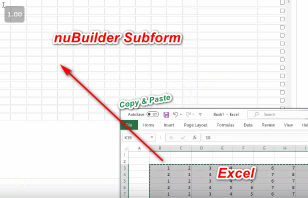

### Subform: Copy from Excel, Paste to a Subform

This code snippet allows you to copy data from Excel (a similar spreadsheet program) and paste it into a nuBuilder subform.


<p align="left">
  
</p>


☛Add this JavaScript Code to your form’s Custom Code field. (Or in the (Setup -> Header), if the function is going to be used in several forms)

❓ [How to add Custom Code](/codelib/common/form_add_custom_code_javascript.gif)

<details>
  <summary>Click to view the code!</summary>
  
```javascript
  
function undoPaste(t) {

    var r = confirm("Undo the last paste? (The values before the insertion will be restored)?");
    if (r == true) {

        $("[data-prevalue]").each(function (index) {
            var v = $(this).attr("data-prevalue");
            $(this).val(v).change();
        });
        nuHide($(this).attr('id'));
    }
}

function pasteToSubform(e, jsonObj) {

    var id = event.target.id;

    var sfId = $('#' + id).attr('data-nu-form');
    var field = $('#' + id).attr('data-nu-field');
    var dRow = parseInt($('#' + String(id)).attr('data-nu-prefix').slice(-3));

    var obj = nuSubformObject(sfId);
    var dColStart = obj.fields.indexOf(field);

    var sNumRows = jsonObj.length;
    var sNumCols = Object.keys(jsonObj[0]).length;

    var sc = 0;
    for (var c = dColStart; c < (dColStart + sNumCols); c++) {
        var sr = 0;
        for (var r = dRow; r < parseInt(dRow + sNumRows); r++) {
            var dest = $('#' + sfId + nuPad3(r) + obj.fields[c]);
            dest.attr("data-prevalue", dest.val());
            dest.val(jsonObj[sr][sc]).change();
            sr++;
        }
        sc++;
    }
}

function getClipboardText(e) {
    var cb;
    var clipText = '';
    if (window.clipboardData && window.clipboardData.getData) {
        cb = window.clipboardData;
        clipText = cb.getData('Text');
    } else if (e.clipboardData && e.clipboardData.getData) {
        cb = e.clipboardData;
        clipText = cb.getData('text/plain');
    } else {
        cb = e.originalEvent.clipboardData;
        clipText = cb.getData('text/plain');
    }
    return clipText;
}

function getClipRows(clipText) {
    var clipRows = clipText.split('\n');
    for (i = 0; i < clipRows.length; i++) {
        clipRows[i] = clipRows[i].split('\t');
    }
    return clipRows;
}

function getClipJson(clipRows) {
    var jsonObj = [];
    for (i = 0; i < clipRows.length - 1; i++) {
        var item = {};
        for (j = 0; j < clipRows[i].length; j++) {
            if (clipRows[i][j] != '\r') {                
                item[j] = clipRows[i][j];                
            }
        }
        jsonObj.push(item);
    }
    return jsonObj;
}

function confirmPaste(e) {
    var r = confirm("Paste data into multiple cells ? (Existing data might be overwritten)");
    if (r == true) {
        return true;
    } else {
        return false;
    }

}


function enableSubformMultiPaste(subformId, selector, undoButton) {

	if (typeof undoButton !== 'undefined') {
         nuHide(undoButton);
    }
				
    $(selector).not(".nuReadonly").on('paste', function (e) {
        var clipText = getClipboardText(e);

        if (clipText.indexOf('\t') >= 0 || clipText.indexOf('\n') >= 0) {

            var clipRows = getClipRows(clipText);
            var jsonObj = getClipJson(clipRows);

            e.stopPropagation();
            e.preventDefault();

            if (confirmPaste(e)) {
                $('[data-nu-form="' + subformId + '"]').removeAttr("data-prevalue");
                pasteToSubform(e, jsonObj);

                if (typeof undoButton !== 'undefined') {
                    nuShow(undoButton);
                }
                window.nuNEW = 0;

            }
        }

    });

}

```

</details>

#### ✪ Example

Call enableSubformMultiPaste() when the form is loaded.  Replace "subform_id" with your Subform Object ID.

```javascript
	if (nuFormType() == 'edit') {
		enableSubformMultiPaste("subform_id","input[type='text'],input[type='nuDate']");
	}
```

Setting up an undo Button:

Add a new Object of type Input/Button to your form with an onclick handler that calls undoPaste(this);
