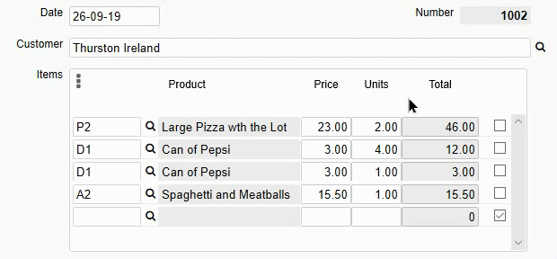

## Subform: Strike through a row

This will strike through a row and turn its text to red when the delete checkbox is ticked.

<p align="left">
  
</p>

☛ Add a *clickdelete* event to your Subform Object.

<p align="left">
  
</p>


☛ Add this JavaScript code to your form's *Custom Code* field:


```javascript
function deleteClicked(event) {

    var id = event.target.id;
    var sf = $('#'+ id).attr('data-nu-checkbox');

    var row = id.substring(sf.length, sf.length + 3);
    style = $('#' + id).is(":checked") ? {
        'color': 'red'
        , 'text-decoration': 'line-through'
    } : {
        'color': 'black'
        , 'text-decoration': 'none'
    };

    $('[id^=' + sf + nuPad3(row) + ']').not(':button').css(style);

}
```


