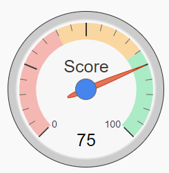

## Third party: How to show a gauge chart?

This article is going to demonstrate how to display a gauge chart using the Google Visualization API.
Use a gauge chart to show numeric values or measurements within a range. For example, use a gauge chart to measure progress toward a goal.

<p align="left">
  
</p>

1. Create a new Object of type HTML. Any object ID can be entered (e.g. gauge_html). Its width and height can be set to a small value, e.g. 15.

☛  Add this code in the HTML field (HTML tab).
   
```html   
<div id="gauge_div" style="width:350px; height: 250px;"></div>
```

2. Add this JavaScript to your form's **Custom Code** field.
   ❓ [How to add Custom Code](/codelib/common/form_add_custom_code_javascript.gif)


```javascript
function outputGaugeStat(title, value, divId, options) {
	google.charts.load('current', {
		'packages': ['gauge']
	});
	google.charts.setOnLoadCallback(function() {
		drawGauge(title, value, divId, options);
	});
	var gaugeOptions = options;

	var gauge;

	function drawGauge(title, value, divId) {
		gaugeData = new google.visualization.DataTable();
		gaugeData.addColumn('number', title);
		gaugeData.addRows(1);
		gaugeData.setCell(0, 0, value);
		gauge = new google.visualization.Gauge(document.getElementById(divId));
		gauge.draw(gaugeData, gaugeOptions);
	}

}

if (nuFormType() == 'edit') {

   var gaugeOptions = {
          min: 0
        , max: 100
        , yellowColor: "#FAD7A0"
        , yellowFrom: 40
        , yellowTo: 70
        , greenColor: "#ABEBC6"
        , greenFrom: 70
        , greenTo: 100
        , redColor: "#F5B7B1"
        , redFrom: 0
        , redTo: 40
        , minorTicks: 5
    };
    

	$(function() {
	   outputGaugeStat('Score','75','gauge_div', gaugeOptions);   
	});

}

```


#### Useful links:

* Documentation: https://developers.google.com/chart/interactive/docs/gallery/gauge

