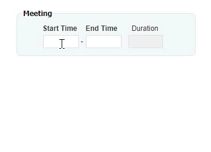

## Third party: jQuery UI Timepicker 

This article is going to show you how to include the [jQuery UI Timepicker](https://github.com/fgelinas/timepicker) by François Gélinas.

It is a simple yet flexible jQuery UI Time Picker.
Based on the existing date picker, this plugin will integrate nicely with your form and use your selected jQuery UI theme.
The plugin is very easy to integrate in your form for your time (hours / minutes) inputs.

<p align="left">
  
</p>


1. **Download** the Timepicker from https://github.com/fgelinas/timepicker/archive/master.zip

2. **Unzip** the archive. and place the contents in a new subdirectory (e.g. "libs\timepicker") of your nuBuilder installation.

3. ☛  Add this code in the **Header** (❓ [Home ► Setup](/codelib/common/setup_header.gif)). Click Save and log in again.


   <details>
     <summary>Click to view the code!</summary>
      
    ```javascript
    </script>

    <link href="libs/jquery.ui.timepicker.css" rel="stylesheet">
  
    <script src='libs/jquery.ui.timepicker.js' type='text/javascript'></script>

    <script>
    ```
    </details>


4. Add this JavaScript to your form's **Custom Code** field.
   ❓ [How to add Custom Code](/common/form_add_custom_code_javascript.gif)


      ☛  Replace *time_obj_id* with the Object Id of the text input Object for which the timepicker should be displayed.

  ```javascript
if (nuFormType() == 'edit') {

    var timeObj = 'time_obj_id';

    if ($('#' + timeObj).data('timepicker') === undefined) {
        $('#' + timeObj).timepicker({
			timeSeparator: ':',           // The caracter to use to separate hours and minutes. (default: ':')
			showLeadingZero: true,        // Define whether or not to show a leading zero for hours < 10. (default: true)
			showMinutesLeadingZero: true, // Define whether or not to show a leading zero for minutes < 10. (default: true)
			showPeriod: false,            // Define whether or not to show AM/PM with selected time. (default: false)
			hourText: 'Hour',             // Define the locale text for "Hours"
			minuteText: 'Minute',         // Define the locale text for "Minute"
			amPmText: ['AM', 'PM'],       // Define the locale text for periods
			defaultTime: '08:00'          // Define a default time to use if displayed inline or input is empty
		});
	}
	nuHasNotBeenEdited();
}	  
```


#### Useful links:

* Documentation: http://fgelinas.com/code/timepicker/#usage
* Examples:http://fgelinas.com/code/timepicker 
