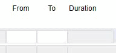

### Calculation: Duration between two Times

The following code calculates the time difference (duration) between a start and end time in 24 hour format (hh:mm). 
It contains validation for each input covering out of range entries, non-number entries and start times after end time errors. 
The output is in total hours and minutes (hh:mm) format. 


<p align="left">
  
</p>


In this example, these two objects (of Type Text) are used: *time_from*, *time_to*

And an object (of Type Text) where the duration is shown: *time_duration*

☛  Replace the Object IDs with your own ones in the function timeChanged().

☛  For the Objects *time_from* and *time_to*, add an onchange event with this JavaScript:

```javascript
timeChanged(event)
```

☛ Add this JavaScript Code to your form’s Custom Code field. 

❓ [How to add Custom Code](/codelib/common/form_add_custom_code_javascript.gif)

```javascript
function isValidTime(timeString) {
    return (timeString.match(/^([0-9]|0[0-9]|1[0-9]|2[0-3]):[0-5][0-9]$/));
}

function validateTimes(t1, t2) {
    if (!isValidTime(t1) || !isValidTime(t2)) {
        return false;
    } else {
        return parseInt(getMinutes(t1)) < parseInt(getMinutes(t2));
    }
}

function calcDuration(t1, t2) {
    var t1 = t1.split(":");
    var t2 = t2.split(":");
    var min1 = parseInt(t1[0]) * 60 + parseInt(t1[1]);
    var min2 = parseInt(t2[0]) * 60 + parseInt(t2[1]);

    var diff = new Date(1000 * 60 * (min2 - min1));
    return nuPad2(diff.getHours()) + ':' + nuPad2(diff.getMinutes());
}

function timeChanged(event) {

    var prefix = $('#' + event.target.id)[0].dataset.nuPrefix;

    var t1 = $("#" + prefix + "time_from").val();
    var t2 = $("#" + prefix + "time_to").val();

    var d = "";
    if (validateTimes(t1, t2)) {
        d = calcDuration(t1, t2);
    }

    $("#" + prefix + "time_duration").val(d).change();

}
```


This code also works if the Objects are in a Subform.
