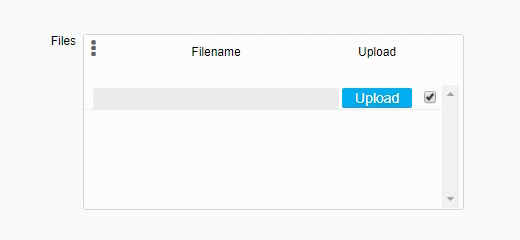
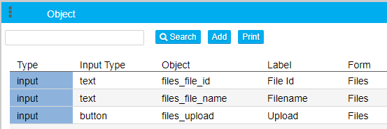
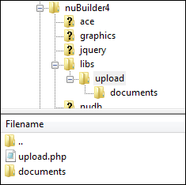

# Uploading a File on button click in a Subform

In this article, I will explain how to upload a file to the server on button click in a nuBuilder Subform and store the file name and its (unique) file id in a separate field in that row.

To do so, we create an upload button and assign an onclick event handler to it which triggers the Click event of a (hidden) Fileupload element which in turn opens the File Upload dialog to choose the file for uploading.
When a File is selected, it triggers the Change event handler of the Fileupload element which then starts the file upload using FormData object and PHP. The form data is sent to a server-side script (upload.php) via Ajax to process the upload and data submission.
Based on the response, the status is shown in a field on the form.

If you just want to try the sample, go ahead and install the [Sample Database](sample%20database).

  

## 1. Add objects to your subform

In your subform, add 3 additional objects: 
(Replace *files_* with your table field prefix. E.g. cus_upload, cus_file_name, cust_file_id)

  

###### 1.1. A button

Type: Input 
Label: Upload 
ID: files_upload 
Input Type (and class): button 
Width: 70 

Custom Code: Event: onclick, Javascript: uploadFile(event); 

The uploadFile() function is later going to be added in the main form's custom code.

  

###### 1.2. A text field

Type: Input 
Input Type (and class): text 
Label: Filename 
ID: files_file_name 
Access: Readonly 
Width: 240 

Also create this column in your database table (in phpMyAdmin). Type: VARCHAR(250)

Purpose of this object: The file name (without prefix) of the uploaded file will be filled into this field.

###### 1.3. A text field

Type: Input 
Input Type (and class): text 
Label: File Id 
ID: files_file_id 
Access: Hidden 

Also create this column in your database table (in phpMyAdmin). Type: VARCHAR(50)

Purpose of this object: The file Id (prefix) of the uploaded file will be filled into this field.

## 2. Add objects to your main form

###### 2.1. A HTML object

Type: HTML 
Label: Upload 
ID: sample_upload 
Access: Hidden 
HTML: Add the code from [input_type_file.htm](input_type_file.htm).

The HTML object holds code which creates a file upload object and processes the file upload

###### 2.2. A Word object

Type: Word 
Label: (a Space) 
ID: sample_msg 
Width: 300 

This object is used to display the upload result.

## 3. Custom Code

In your main form's Custom Code, add the Javascript from this file: 

[form_custom_code.js](form_custom_code.js).

  

 

Revise the configuration settings as needed. (uploadFolder etc.)

## 4. Create folders

Create a new folder /libs/upload/ in the root directory of nuBuilder where the uploaded files will be moved. 
Also create a subfolder in that upload folder named documents.

  

## 5. Upload.php

Place the [upload.php](upload.php) in the folder /libs/upload/ 
Edit the permitted file types allowed for the file upload. Change the upload directory ($uploaddir) if necessary.
