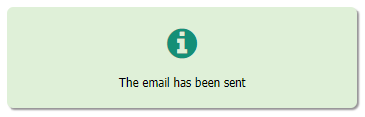
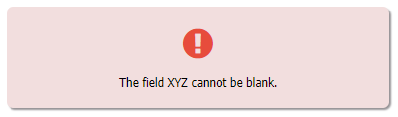

### UX: Enhance the appearance of a Message Box

The funtions messageInfo() and messageError() are enhanced versions of [nuMessage()](https://wiki.nubuilder.net/nubuilderforte/index.php/Javascript#nuMessage) and display a message with an info  
respectively an exclamation symbol.

Optionally, the message can be automatically hidden after a certain period of time.

☛ Add this JavaScript to your form’s *Custom Code* field or in the (Setup -> Header), if the function is going to be used in several forms.

❓ [How to add Custom Code](/codelib/common/form_add_custom_code_javascript.gif)

```javascript
function messageInfo(msg, timeout, closedCallback) {

    nuMessage(['<i class="fa fa-info-circle fa-3x" aria-hidden="true" style="color:#148F77;"></i><br>', msg]);
    var msg = $('#nuMessageDiv');
    msg.css({
        'background-color': '#dff0d8',
        'box-shadow': '2px 2px 2px 0px rgba(150,147,150,1)',
        'border': '1px solid transparent',
        'border-radius': '7px'
    });

    if (timeout !== undefined) {
        setTimeout(function() {
            msg.fadeOut("slow");

            if (closedCallback !== undefined) {
                closedCallback();
            }

        }, timeout);
    }
}


function messageError(msg, timeout, closedCallback) {

    nuMessage(['<i class="fa fa-exclamation-circle fa-3x" aria-hidden="true" style="color:#E74C3C;"></i><br>', msg]);
    var msg = $('#nuMessageDiv');
    msg.css({
        'background-color': '#f2dede',
        'border-color': '#ebccd1',
        'box-shadow': '2px 2px 2px 0px rgba(150,147,150,1)',
        'border': '1px solid transparent',
        'border-radius': '7px'
    });

    if (timeout !== undefined) {
        setTimeout(function() {
            msg.fadeOut("slow");

            if (closedCallback !== undefined) {
                closedCallback();
            }

        }, timeout);
    }

}
```

#### ✪ Example 1: 

Show an information message after the form has been saved, hide it after 2 seconds and take the user back to the previous breadcrumb.

<p align="left">
  
</p>

```javascript

function goToPreviousBreadcrumb() {
    var l = window.nuFORM.breadcrumbs.length;
    if (l > 1) {
        nuGetBreadcrumb(l - 2);
    }
}

if (nuFormType() == 'edit') {

    if (nuHasBeenSaved() > 0) {

        var closedCallback = function(data, textStatus, jqXHR) {
            nuHasNotBeenEdited();
            goToPreviousBreadcrumb();
        }
        messageInfo('The email has been sent!', 3000, closedCallback);

    }

}
```


#### ✪ Example 2: 

Show an error message after the form has been saved.

<p align="left">
  
</p>


```javascript
function nuBeforeSave() {

	if ($('#XYZ').val() == '') {
		messageError('The field XYZ cannot be blank.');
		return false;
	}

	return true;
}
```
