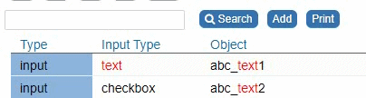

## UX: Transform the Search Field into a Type Search

The function searchFieldSetSearchType() transforms nuBuilder's search field into a **type="search"** element and adds an "x" icon to clear the field once you start typing.

<p align="left">
  
</p>


☛  Add this JavaScript code in the Header (❓ [Home ► Setup](/codelib/common/setup_header.gif)). Click Save and log in again.

```javascript
// Transform to Input Type Search
function searchFieldSetSearchType() {
  if (nuFormType() == 'browse') {
	  $("#nuSearchField")
		  .prop("type", "search")
		  .attr('autocomplete', 'off')
		  .on('search', function () {
			  nuSearchAction();
		  });
  }
}

function nuOnLoad() {
    searchFieldSetSearchType();
}
```
