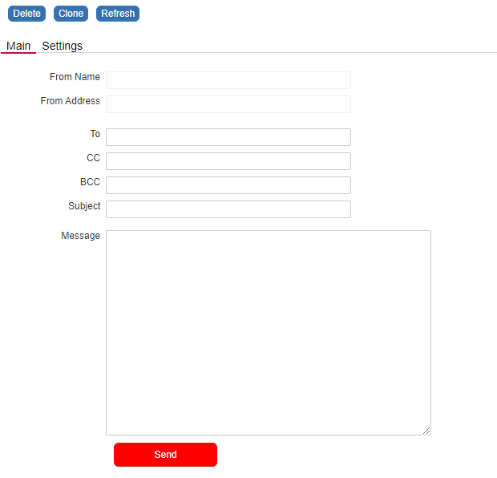

## UX: Position the Save Button within the Form

<p align="left">
  
</p>


☛ Add this JavaScript to your form's Custom Code field:
 ❓ [How to add Custom Code](/codelib/common/form_add_custom_code_javascript.gif)

```javascript
// Show the Save button only if the first tab is selected
function showHideSaveButton(tabID) {
    tabID == 'nuTab0' ? $('#nuSaveButton').show() : $('#nuSaveButton').hide();
}

if (nuFormType() == 'edit') {

    // Add a click event to the Tabs
    $(".nuTab").click(function () {
        showHideSaveButton(this.id);
    });

    showHideSaveButton($('.nuTabSelected').attr('id'));

    // Attach the Save button to another object. E.g. to ema_message in this example.
    attachSaveButtonTo('ema_message');
}

jQuery.fn.cssNumber = function (prop) {
    var v = parseInt(this.css(prop), 10);
    return isNaN(v) ? 0 : v;
};

function attachSaveButtonTo(dest) {

    var d = $('#' + dest);
    d.after($('#nuSaveButton'));
    $('#nuSaveButton').css({
        "top": d.cssNumber("top") + d.cssNumber("height") + 15,
        "left": d.cssNumber("left"),
        "width": "129px",
        "position": "absolute",
        "height": "30px"
    });
}
```
