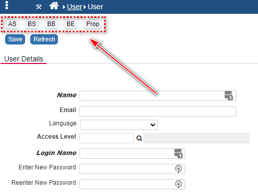

## Globeadmin: Add additional Developer Action Buttons

The function addDevButtons() adds additional buttons for the globeadmin for quick access to the Form Properties, PHP Events. 

<p align="left">
  
</p>


☛  Add this JavaScript and CSS code in the Header (❓ [Home ► Setup](/common/setup_header.gif)). Click Save and log in again.

```javascript
function editPHP(type) {
    nuForm('nuphp', nuCurrentProperties().form_id + '_' + type, 'justphp', '', 2);
}

function addDevButton(i, v, f) {
    var button = "<input id='nu" + i + "Button' type='button' class='nuActionButton' value='" + nuTranslate(v) + "' onclick='" + f + "'>";
    $('#nuActionHolder').prepend(button);
}

function addDevButtons() {

    if (global_access) {
        var ft = nuCurrentProperties().form_type;
        var b = ft.indexOf("browse") >= 0;
        var e = ft.indexOf("edit") >= 0;
        var l = ft.indexOf("launch") >= 0;

        $('#nuActionHolder').css('height', '50px');

        addDevButton("DevBtnProperties", "Prop", "nuForm('nuform', window.nuFORM.getCurrent().form_id, '', '', 2);");
        if (b || l) { addDevButton("DevBtnBE", "BE", 'editPHP("BE");'); }
        if (e) { addDevButton("DevBtnBB", "BB", 'editPHP("BB");'); }
        if (e) { addDevButton("DevBtnBS", "BS", 'editPHP("BS");'); }
        if (e) { addDevButton("DevBtnAS", "AS", 'editPHP("AS");'); }

        $("input[type='button'][id^='nuDevBtn']").css({ 'margin-bottom': '10px', 'background-color': '#f6f6f6', 'background-image': 'none', 'color': 'black', 'border-color': '#9fa5a9', 'text-shadow': 'none' });
        $("<br>").insertAfter($("#nuDevBtnPropertiesButton"));
    }

}

function nuOnLoad() {
    addDevButtons();
}
```

