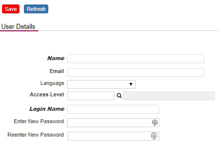

###  Globeadmin Helper: Add Title for objects

As an administrator, you sometimes want to know the ID of an object at a glance.
By adding this code under Setup -> Header, the Id of an object is displayed when you move the mouse moves an object. 

<p align="left">
  
</p>


```
function nuOnLoad() {

    // Globeadmin Helper: Quickly View the Id for objects
    var acl = nuAccessLevelCode();
    if (acl == '') {

        $("*").each(function() {
            var id = $(this).attr('id');
            if (id !== undefined) {
                $(this).attr('title', 'ID: ' + id);
            }
        });

    }
}
```

