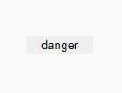

## Object: Conditionally Change its Color

This snippet will show you how to conditionally change the color of an object (e.g. Display Object) in reference to the content.
E.g. setting a red background color with a bold font if the display text is "danger".

<p align="left">
  
</p>


☛ Add this JavaScript code to your form's _Custom Code_ field


```javascript
function setConditionalColors(id, conditions) {
    obj = $('#' + id);
    for (cond in conditions) {
        if (obj.val() === cond) {
            obj.css('background-color', conditions[cond]['bg']);
            obj.css('color', conditions[cond]['fg']);
            obj.css('font-weight', conditions[cond]['weight']);
            break;
        }
    }
}
```

#### ✪ Example: 

Call the function setConditionalColors() when the Edit Screen is loaded.
If the object contains the word danger, its background is going to be red with a white font and a bold font-weight.

```javascript
// bg: background color, fg: foreground color, weight: font feight
var colorConditions = {
    'danger':  {'bg': 'red', 'fg': 'white', 'weight': 'bold'},
    'fine':    {'bg': 'green', 'fg': 'white', 'weight': 'normal'},
    'other':   {'bg': 'black', 'fg': 'white', 'weight': 'normal'}
};

if (nuFormType() == 'edit') {
   setConditionalColors('objId ', colorConditions);  // replace objId with your object id
}
```
