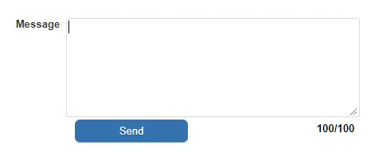

### Object: Limit character input in a text field including count

The function limitTextLength() limits the number of characters allowed to type in text fields and optionally displays how many characters are left.

<p align="left">
  
</p>


☛Add this JavaScript Code to your form’s Custom Code field:


```javascript

/**
* Limit character input in a textarea including count
*
* @param {string}  id          - Object ID of the text field / textarea
* @param {int}     maxLength   - Specify the maximum allowed characters
* @param {string}  [objectId]  - Object Id of the label
*
*/

function limitTextLength(id, maxLength, label) {

	$('#' +id).attr('maxlength', maxLength);
	
	if (typeof label !== "undefined") {
		 $('#' + label).html(maxLength + '/' + maxLength);
		 $('#' + id).keyup(function () {
            var textlen = maxLength - $(this).val().length;
            $('#' + label).html(textlen + '/' + maxLength);
        });
	}
        
}
```

#### ✪ Example

Limit the number of characters to 100 in the textarea with ID "my_message" and display the remaining characters in a Word Type object "my_message_count"

```
limitTextLength('my_message',100,'my_message_count');

```

