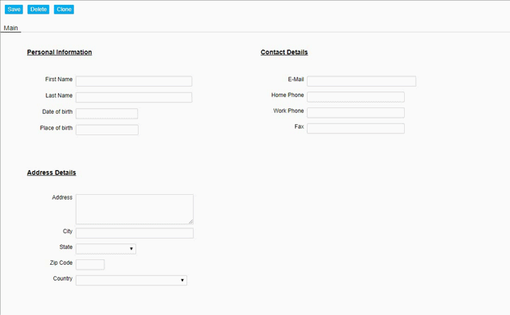

### Visually group related objects

Visually group objects that belong together to create a clear user interface.

<p align="left">
  
</p>

☛ Add this CSS in the Header under Home ► Setup. Click Save and log in again.

```css
<style>

.content-box-header .content {
    height: inherit;
    border-bottom-left-radius: 7px;
    border-bottom-right-radius: 7px;
    border: 1px solid #dddddd;
    background-color: #fff;
}

.content-box-header .title {
    height: 4px;
    line-height: 4px;
    font-size: 14px;
    font-weight: bold;
    display: block;
    margin: -1px;
    padding: 9px;
    letter-spacing: 1px;
}

.content-box-header {
    z-index: -1;
    position: absolute;
    height: 150px;
    width: 250px;
}

</style>

```

☛ In your form, create a new object of type HTML. Set its Width and Height to 10.

☛ Add this html code to the HTML field.

```html
<div class="content-box-header" style="height: 220px; width: 480px;">
    <div class="title">Personal Information</div>
    <div class="content"></div>
</div>
```

☛ Change the style and title as needed.
