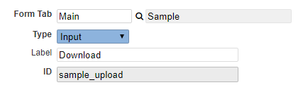
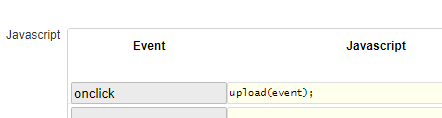
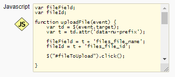

## 1. Add objects to your subform

In your subform, add 3 additional objects: 
(Replace *sample* with your table field prefix. E.g. cus_upload, cus_file_name, cust_file_id)

###### 1.1. A button

Type: Input 
Label: Download 
ID: sample_upload 
Input Type (and class): Button 

  

Custom Code: Event: onclick, Javascript: upload(event); 

  

###### 1.2. A text field

Type: Input 
Label: Filename 
ID: sample_file_name 
Access: Readonly 

  

Also create this column in your database table (in phpMyAdmin). Type: VARCHAR(100)

###### 1.3. A text field

Type: Input 
Label: File Id 
ID: sample_file_id 
Access: Hidden 

  

Also create this column in your database table (in phpMyAdmin). Type: VARCHAR(50)

## 2. Add objects to your main form

###### 2.1. A HTML object

Type: HTML 
Label: Upload 
ID: sample_upload 
Access: Hidden 
HTML: Add the code from [input_type_file.html](input_type_file.html).

## 3. Custom Code

In your main form's Custom Code, add the Javascript from this file: 

[form_custom_code.js](form_custom_code.js).

  

 
(Replace *sample* with your table field prefix. E.g. cus_file_name, cus_file_id)

## 4. Create Folders

Create a new folder /libs/upload/ in the root directory of nuBuilder. Also create a new folder in the upload folder named documents.

  

## 5. Upload.php

Place the [upload.php](upload.php) in folder /libs/upload/
